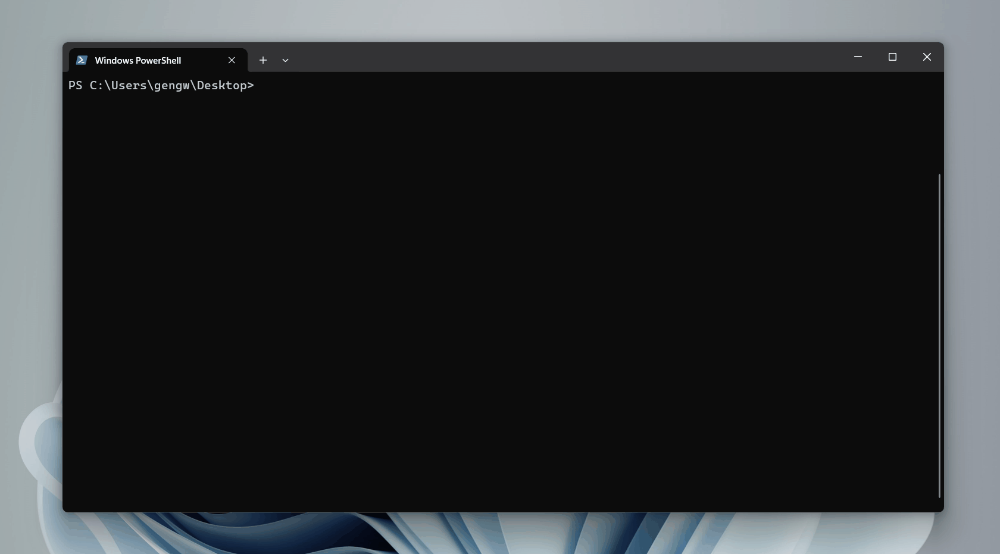

# 练习 HTTP 实现一个 Web 框架

## Quick Start

install

```shell
npm install -g geng-web
```

init project

```shell
gweb init web-demo
cd web-demo
pnpm install
pnpm run dev
```



## 计划列表

- [x] CLI 功能
- [ ] ORM 支持
- [ ] API 文档
- [ ] 单元测试、e2e
- [ ] 持续集成
